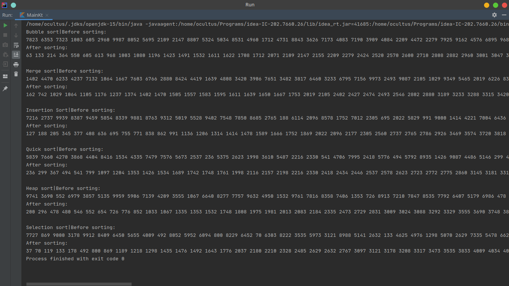

# Kotlin Sorting factory
Factory has Bubble, Insertion, Merge, Quick, Selection and Heap sort
Kotlin implementation of pattern Factory Method and Singleton

### How to start
1. Clone this repository.
2. Just open folder by Intellij Idea.

      or

    Install kotlin compiler by [following instruction](https://kotlinlang.org/docs/tutorials/command-line.html)

    ```
    $ sh start
    ```

### Expected Result:

